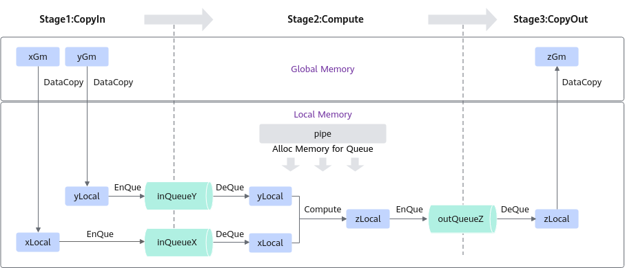

[text](https://www.hiascend.com/document/detail/zh/CANNCommunityEdition/80RC1alpha003/devguide/opdevg/ascendcopdevg/atlas_ascendc_10_0016.html)

## Add算子分析  

``` tree
Add
|-- input                                                 // 存放脚本生成的输入数据目录
|-- output                                                // 存放算子运行输出数据和真值数据的目录
|-- CMakeLists.txt                                        // 编译工程文件
|-- add_custom.cpp                                      // 算子kernel实现
|-- scripts
|  ├── gen_data.py                                    // 输入数据和真值数据生成脚本文件
|  ├── verify_result.py                              // 验证输出数据和真值数据是否一致的验证脚本
|-- cmake                                                 // 编译工程文件
|-- data_utils.h                                          // 数据读入写出函数
|-- main.cpp                                             // 主函数，调用算子的应用程序，含CPU域及NPU域调用
|-- run.sh                                               // 编译运行算子的脚本
```

基本范式:


```C++
//add_custom.cpp
#include "kernel_operator.h"
using namespace AscendC;

constexpr int32_t TOTAL_LENGTH = 8 * 2048;                            // total length of data
constexpr int32_t USE_CORE_NUM = 8;                                   // num of core used
constexpr int32_t BLOCK_LENGTH = TOTAL_LENGTH / USE_CORE_NUM;         // length computed of each core
constexpr int32_t TILE_NUM = 8;                                       // split data into 8 tiles for each core
constexpr int32_t BUFFER_NUM = 2;                                     // tensor num for each queue
constexpr int32_t TILE_LENGTH = BLOCK_LENGTH / TILE_NUM / BUFFER_NUM; // seperate to 2 parts, due to double buffer
// 参数设置区

class KernelAdd {
public: 
/*定义外部接口
KernelAdd
Init：初始化函数，用于从global memory获取数据，然后将数据推入pipe中
Process：处理函数，
*/
    __aicore__ inline KernelAdd() {}
    __aicore__ inline void Init(GM_ADDR x, GM_ADDR y, GM_ADDR z)
    {
        xGm.SetGlobalBuffer((__gm__ half*)x + BLOCK_LENGTH * GetBlockIdx(), BLOCK_LENGTH);
        yGm.SetGlobalBuffer((__gm__ half*)y + BLOCK_LENGTH * GetBlockIdx(), BLOCK_LENGTH);
        zGm.SetGlobalBuffer((__gm__ half*)z + BLOCK_LENGTH * GetBlockIdx(), BLOCK_LENGTH);
        // 设置输入输出Global Tensor的Global Memory内存地址。地址与核的index有关（GetBlockIdx()）
        pipe.InitBuffer(inQueueX, BUFFER_NUM, TILE_LENGTH * sizeof(half));
        pipe.InitBuffer(inQueueY, BUFFER_NUM, TILE_LENGTH * sizeof(half));
        pipe.InitBuffer(outQueueZ, BUFFER_NUM, TILE_LENGTH * sizeof(half));
        // 通过Pipe内存管理对象为输入输出Queue分配内存。 
        // BUFFER_NUM：把数据分成n份，用于并行。 TILE_LENGTH 每块数据的长度
    }
    __aicore__ inline void Process()
    {
        int32_t loopCount = TILE_NUM * BUFFER_NUM;
        for (int32_t i = 0; i < loopCount; i++) {
            CopyIn(i);
            Compute(i);
            CopyOut(i);
        }
    }

private:
    // 实现三个具体操作函数
    __aicore__ inline void CopyIn(int32_t progress)
    {
        // 将数据从global memory复制到local memory
        LocalTensor<half> xLocal = inQueueX.AllocTensor<half>();
        LocalTensor<half> yLocal = inQueueY.AllocTensor<half>();
        DataCopy(xLocal, xGm[progress * TILE_LENGTH], TILE_LENGTH);
        DataCopy(yLocal, yGm[progress * TILE_LENGTH], TILE_LENGTH);
        // 复制数据
        inQueueX.EnQue(xLocal);
        inQueueY.EnQue(yLocal);
        // 数据入队
    }
    __aicore__ inline void Compute(int32_t progress)
    {
        // 计算函数
        LocalTensor<half> xLocal = inQueueX.DeQue<half>();
        LocalTensor<half> yLocal = inQueueY.DeQue<half>();
        LocalTensor<half> zLocal = outQueueZ.AllocTensor<half>();
        Add(zLocal, xLocal, yLocal, TILE_LENGTH);
        // 调用加法函数。
        outQueueZ.EnQue<half>(zLocal);
        inQueueX.FreeTensor(xLocal);
        inQueueY.FreeTensor(yLocal);
    }
    __aicore__ inline void CopyOut(int32_t progress)
    {
        // 将结果从local memory复制到global memory
        LocalTensor<half> zLocal = outQueueZ.DeQue<half>();
        DataCopy(zGm[progress * TILE_LENGTH], zLocal, TILE_LENGTH);
        outQueueZ.FreeTensor(zLocal);
    }

private:
    //定义管道、队列、GlobalTensor
    TPipe pipe;
    TQue<QuePosition::VECIN, BUFFER_NUM> inQueueX, inQueueY;
    TQue<QuePosition::VECOUT, BUFFER_NUM> outQueueZ;
    GlobalTensor<half> xGm;
    GlobalTensor<half> yGm;
    GlobalTensor<half> zGm;
};

extern "C" __global__ __aicore__ void add_custom(GM_ADDR x, GM_ADDR y, GM_ADDR z)
{
    //函数原型定义
    KernelAdd op;
    op.Init(x, y, z);
    op.Process();
}

#ifndef __CCE_KT_TEST__ //表示该封装函数仅在编译运行NPU侧的算子时会用到
// call of kernel function
void add_custom_do(uint32_t blockDim, void* l2ctrl, void* stream, uint8_t* x, uint8_t* y, uint8_t* z)
{
    add_custom<<<blockDim, l2ctrl, stream>>>(x, y, z);
    //<<<运算核数，保留参数，同步流>>>
}
#endif


```

``` c++
// main.cpp
/*
 * Copyright (c) Huawei Technologies Co., Ltd. 2022-2023. All rights reserved.
 * This file constains code of cpu debug and npu code.We read data from bin file
 * and write result to file.
 */
#include "data_utils.h"
#ifndef __CCE_KT_TEST__
#include "acl/acl.h"
extern void add_custom_do(uint32_t coreDim, void* l2ctrl, void* stream, uint8_t* x, uint8_t* y, uint8_t* z);
#else
#include "tikicpulib.h"
extern "C" __global__ __aicore__ void add_custom(GM_ADDR x, GM_ADDR y, GM_ADDR z);
#endif

int32_t main(int32_t argc, char* argv[])
{
    uint32_t blockDim = 8;
    size_t inputByteSize = 8 * 2048 * sizeof(uint16_t);
    size_t outputByteSize = 8 * 2048 * sizeof(uint16_t);
    
#ifdef __CCE_KT_TEST__
    // 用于CPU调试的调用程序
    uint8_t* x = (uint8_t*)AscendC::GmAlloc(inputByteSize);
    uint8_t* y = (uint8_t*)AscendC::GmAlloc(inputByteSize);
    uint8_t* z = (uint8_t*)AscendC::GmAlloc(outputByteSize);

    ReadFile("./input/input_x.bin", inputByteSize, x, inputByteSize);
    ReadFile("./input/input_y.bin", inputByteSize, y, inputByteSize);

    AscendC::SetKernelMode(KernelMode::AIV_MODE);
    ICPU_RUN_KF(add_custom, blockDim, x, y, z); 
    // 调用cpu测试宏

    WriteFile("./output/output_z.bin", z, outputByteSize);

    AscendC::GmFree((void *)x);
    AscendC::GmFree((void *)y);
    AscendC::GmFree((void *)z);
#else
    // NPU侧运行算子的调用程序
    CHECK_ACL(aclInit("./scripts/acl.json"));
    aclrtContext context;
    int32_t deviceId = 0;
    CHECK_ACL(aclrtSetDevice(deviceId));
    CHECK_ACL(aclrtCreateContext(&context, deviceId));
    aclrtStream stream = nullptr;
    CHECK_ACL(aclrtCreateStream(&stream));

    uint8_t *xHost, *yHost, *zHost;
    uint8_t *xDevice, *yDevice, *zDevice;

    CHECK_ACL(aclrtMallocHost((void**)(&xHost), inputByteSize));
    CHECK_ACL(aclrtMallocHost((void**)(&yHost), inputByteSize));
    CHECK_ACL(aclrtMallocHost((void**)(&zHost), outputByteSize));
    CHECK_ACL(aclrtMalloc((void**)&xDevice, inputByteSize, ACL_MEM_MALLOC_HUGE_FIRST));
    CHECK_ACL(aclrtMalloc((void**)&yDevice, inputByteSize, ACL_MEM_MALLOC_HUGE_FIRST));
    CHECK_ACL(aclrtMalloc((void**)&zDevice, outputByteSize, ACL_MEM_MALLOC_HUGE_FIRST));

    ReadFile("./input/input_x.bin", inputByteSize, xHost, inputByteSize);
    ReadFile("./input/input_y.bin", inputByteSize, yHost, inputByteSize);

    CHECK_ACL(aclrtMemcpy(xDevice, inputByteSize, xHost, inputByteSize, ACL_MEMCPY_HOST_TO_DEVICE));
    CHECK_ACL(aclrtMemcpy(yDevice, inputByteSize, yHost, inputByteSize, ACL_MEMCPY_HOST_TO_DEVICE));

    add_custom_do(blockDim, nullptr, stream, xDevice, yDevice, zDevice);
    CHECK_ACL(aclrtSynchronizeStream(stream));

    CHECK_ACL(aclrtMemcpy(zHost, outputByteSize, zDevice, outputByteSize, ACL_MEMCPY_DEVICE_TO_HOST));
    WriteFile("./output/output_z.bin", zHost, outputByteSize);

    CHECK_ACL(aclrtFree(xDevice));
    CHECK_ACL(aclrtFree(yDevice));
    CHECK_ACL(aclrtFree(zDevice));
    CHECK_ACL(aclrtFreeHost(xHost));
    CHECK_ACL(aclrtFreeHost(yHost));
    CHECK_ACL(aclrtFreeHost(zHost));

    CHECK_ACL(aclrtDestroyStream(stream));
    CHECK_ACL(aclrtDestroyContext(context));
    CHECK_ACL(aclrtResetDevice(deviceId));
    CHECK_ACL(aclFinalize());
#endif
    return 0;
}

```